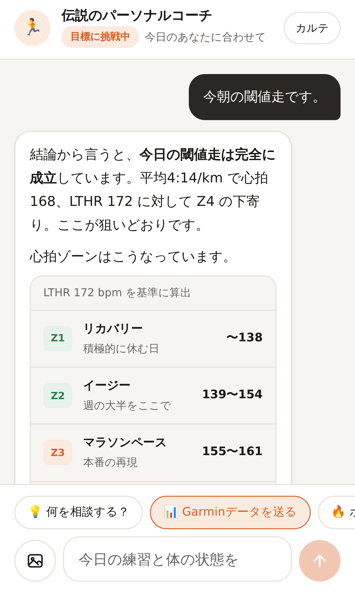
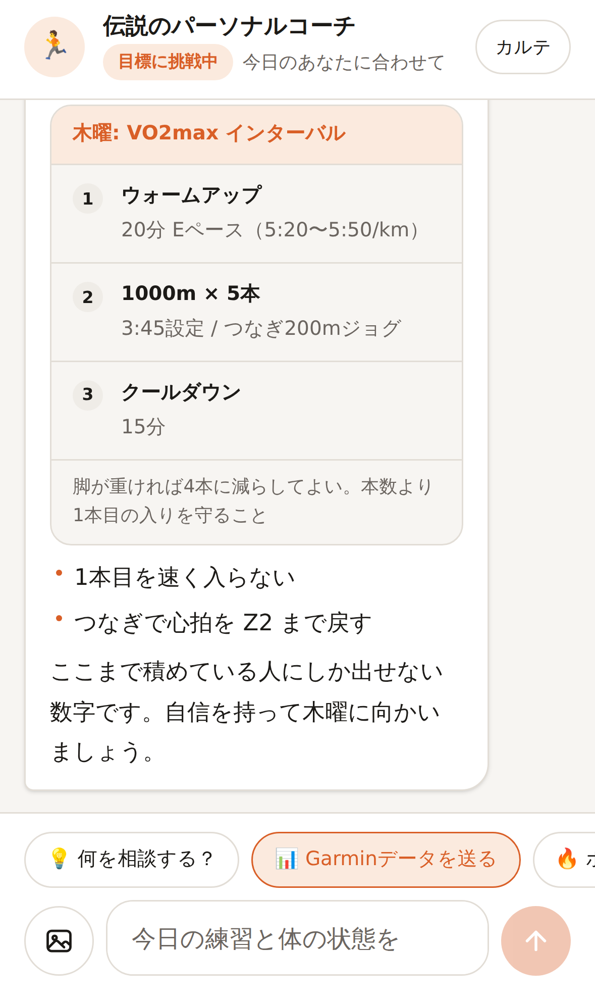
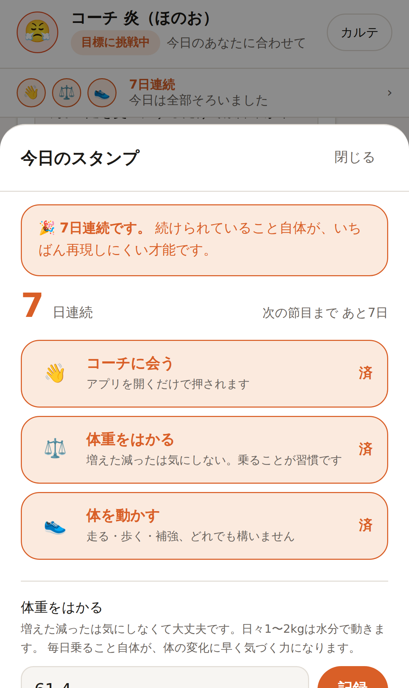
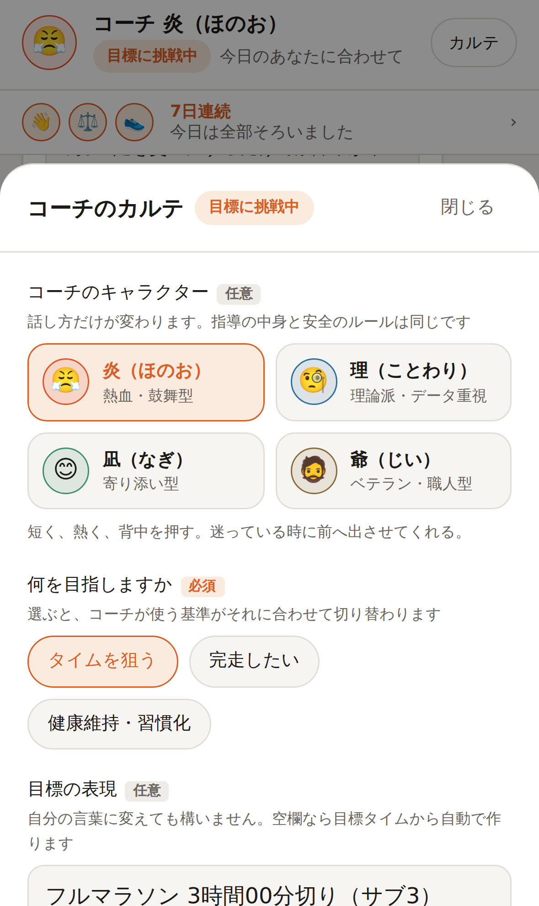
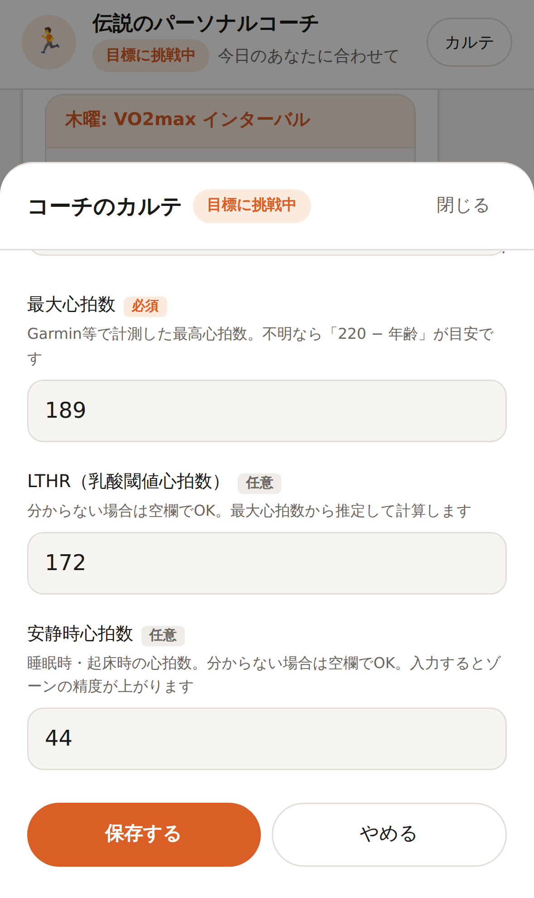

# 伝説のランニングコーチ

自分で決めた目標へ向かうランナーのための、専属パーソナルコーチAI。

サブ3でも、サブ4でも、完走でも、健康維持でも構いません。**目標が変われば基準の数字が変わるだけで、
見る観点（強度配分・心拍・フォーム・疲労）と分析の深さは変わりません。**
一般的なランニングアプリのように固定メニューを配ることはせず、当たり障りのない励ましもしません。
数字と生理学的な根拠で語り、良くない練習には良くないと言い、そのうえで必ず次の一手を示します。
ランニングアプリのスクリーンショットを送れば、その場で読み取って評価します。

| 心拍ゾーン | 練習メニュー | 毎日のスタンプ | コーチの選択 |
| --- | --- | --- | --- |
|  |  |  |  |

## このコーチが守っていること

### 1. 目標から基準を導き、それに沿って評価する

コーチが持つ原則は、どのレベルのランナーにも共通です（`src/lib/prompt.ts`）。

- **週の8割はイージー、2割がポイント練習。** イージーが速すぎるのが最大の失敗
- 走行距離を増やすのは**前週比10%以内**。距離を積む速度が故障を決める
- 心拍ゾーンは HRmax / LTHR 基準。**基準値を持っていなければゾーン評価をせず、推測せずに尋ねる**
- ピッチ180spm前後。**膝の故障歴があるランナーでは、まずオーバーストライドを疑う**
- ロング走は距離を踏むこと自体が目的ではなく、後半に落とさず終えられたかで評価する

変わるのは**基準となる数字だけ**です。目標タイムから必要ペースを計算し、
そこから各強度のペースを導きます（`src/lib/goals.ts`）。

| 目標 | レースペース | 閾値走 | インターバル | VDOT | 週間距離の目安 |
| --- | --- | --- | --- | --- | --- |
| 2時間05分 | 2:57/km | 2:49/km | 2:37/km | 82 | 週160〜220km（2部練習前提） |
| サブ2.5 | 3:33/km | 3:23/km | 3:08/km | 66 | 週130〜180km |
| サブ3 | 4:15/km | 4:04/km | 3:46/km | 53 | 週60〜80km |
| サブ3.5 | 4:58/km | 4:45/km | 4:24/km | 45 | 週50〜70km |
| サブ4 | 5:41/km | 5:25/km | 5:01/km | 38 | 週40〜55km |
| サブ5 | 7:06/km | 6:47/km | 6:17/km | 29 | 週30〜40km |
| 完走 | ペースより「止まらずに動き続けられる時間」で評価 | | | | 週25〜35km |
| 健康維持 | 距離とタイムのノルマを置かない | | | — | — |

目標タイムは **1時間55分から5時間30分まで5分刻み**で選べます。
刻みに無いタイムは「その他」から 時・分・秒 を選びます。
**タイムはすべて選ぶ形にしてあります。** スマホの数字キーボードにはコロンが無く、
文字入力では「3:05:00」がそもそも打てないためです。
世界記録水準まで含めているため、キロ2分台・3分台の練習ペースも正しく算出されます。

VDOT は Daniels の式（速度と持続時間から最大酸素摂取量を推定する）で目標タイムから計算し、
強度の物差しとしてコーチに渡しています。2時間30分を切る水準では、
市民ランナー向けの一般論をそのまま当てないよう、プロンプト側で明示的に切り替えています。

> 必要ペースは**切り捨て**で表示します。3時間切りに必要なのは 4:15.9/km ですが、
> これを四捨五入して 4:16 と伝えると、その通り走った人は 3:00:21 でゴールしてしまうためです。

目標が未設定のうちは、コーチはペース基準を出しません。まず目標と走力を尋ねます。

### 1-2. 目標も故障歴も、本人が設定・変更できる

「カルテ」画面の**編集**から、いつでも変更できます。

- 目指すもの（タイムを狙う / 完走したい / 健康維持・習慣化）
- 目標タイム（1時間55分〜5時間30分を5分刻みで選択。iPhone ではドラムロールとして開きます）
- 大会ごとの目標タイム（時・分・秒を選ぶ。ウルトラ向けに時間は23まで）
- 目標ペース（空欄なら目標タイムから自動計算。手動指定があればそちらを優先）
- 大会名・本番の日
- **故障歴・気になる部位**（1行1件。負荷を上げる判断のたびにコーチが考慮する）
- 最大心拍数（必須）/ LTHR（任意）/ 安静時心拍数（任意）

各項目には **(必須) / (任意)** のラベルと補足説明が付いています。
必須の最大心拍数が空欄でも保存はでき、その場合は「心拍ゾーンの評価ができません」と画面で伝えます。



目標を選んだ瞬間に、その目標での基準ペースが画面上で確認できます。
保存すると、次のターンからコーチの評価基準がそれに切り替わります。

### 2. 痛みには、プロンプトではなくコードで歯止めをかける

「少しでも痛みがあれば絶対に走らせない」は、モデルの気分に委ねてよいルールではありません。
そこで `src/lib/safety.ts` に二段構えの安全層を置いています。

1. **事前**: 未解消の痛みが1つでもあれば、走行禁止の強制指示をシステムプロンプトへ機械的に差し込む。
   フェーズ判定も `recovery` に上書きされ、モデルの判断より優先される。
2. **事後**: 生成された文章を走行指示の検査にかける。痛みがある間は**検査を通るまで一文字も画面に流さず**、
   走行メニューが混ざっていたらその回答は履歴にも残さず、書き直させてから届ける。

「右膝が痛い」と打った瞬間から、まだカルテが更新される前でも慎重モードに入ります。

### 3. 生活の制約を、責めずに受け止める

「今日は忙しい」「疲れていてやる気が出ない」は、入力欄の上のワンタップで言えます。
コーチは責める代わりに即座に代替案を出し、メニューには最初から
「時間が取れない時」「疲れが強い時」の逃げ道を持たせます（`set_today_plan` の `alternatives`）。

### 4. 学習した内容は、いつでも本人が確認・削除できる

コーチが覚えていることは「カルテ」画面にすべて開示されます。ワンタップで全消去もできます。

## 複数の大会に出る

カルテの「編集」→「出場する大会」から、何件でも登録できます（`src/lib/races.ts`）。
シーズンに何本も走る人にとって、大会が1つしか持てないのは実情に合いません。

| 位置づけ | 意味 | コーチの扱い |
| --- | --- | --- |
| A | 本命 | **ここに向けて仕上げる。** 残り日数から練習の時期を決める |
| B | 調整レース | 本番の予行演習。補給・シューズ・ペース配分を試す場 |
| C | 練習の一環 | ポイント練習の代わり。タイムは狙わない |

Aレースまでの残り日数から、いま何を積む時期かが決まります。

| 残り | 時期 | 積むもの |
| --- | --- | --- |
| 113日〜 | 基礎期 | イージー中心で総量と脚を作る |
| 57〜112日 | 走り込み期 | ロング走を伸ばし、閾値走を軸に置く |
| 22〜56日 | 専門期 | レースペース走の比率を最も高くする |
| 8〜21日 | 調整期 | 距離を毎週2〜3割落とし、強度は残す |
| 〜7日 | レース週 | 新しい刺激を入れない |

**フルマラソン同士が3週間以内に並んでいる場合は、両方を全力で走る前提の計画を立てません。**
フル後の回復には3〜4週間かかるためで、どちらを本命にするかを必ず本人に確かめます。

会話の中で聞いた大会は `add_race` で1件ずつ追加され、既にある大会を置き換えません。

## コーチのキャラクターを選ぶ

カルテの「編集」から、コーチの人格を選べます。顔アイコンと名前が画面に反映されます。

画面上部の顔写真をタップすると、全員のプロフィールが開きます。
経歴・得意なこと・**こういう人におすすめ**・話し方の例まで見てから選べます。

| コーチ | 肩書き | こういう人に |
| --- | --- | --- |
| 白石 遼（しらいし りょう） | データ分析型 | 「なぜこの練習か」が分からないと動けない（既定） |
| 岩井 大河（いわい たいが） | 鼓舞型 | ひとりだと練習を先延ばしにしてしまう |
| 森 健三（もり けんぞう） | 名伯楽 | 何度も同じ箇所を故障している |
| 黒沢 玲子（くろさわ れいこ） | 戦略家 | 1年に何本もの大会にエントリーしている |
| 藤堂 蒼（とうどう あおい） | 元トップ選手 | 30km以降の失速を毎回繰り返している |
| 三浦 凪沙（みうら なぎさ） | 伴走型 | 走れなかった日に自分を責めてしまう |
| 本田 陽菜（ほんだ はるな） | 習慣づくり | タイムより、まず走る習慣をつけたい |

顔写真は `public/coaches/` に置いた画像です（1枚あたり約3KB）。
読み込めない場合は姓の頭文字に落ちるので、空の丸が並ぶことはありません。

**変わるのは話し方だけです。** 指導の中身、痛みへの配慮、責めない原則は、
どのキャラクターでも一切変わりません。優しいキャラだから痛みを見逃す、
熱血キャラだから無理をさせる、ということが起きないようテストで固定しています。

## 毎日のスタンプと体重の習慣

画面上部の帯に、その日のスタンプと連続日数が出ます。

| スタンプ | 条件 |
| --- | --- |
| 👋 コーチに会う | アプリを開く |
| ⚖️ 体重をはかる | 体重を記録する |
| 👟 体を動かす | 走る・歩く・補強のいずれかを記録する |

走れなかった日を空白にすると、それ自体が責める仕組みになります。
**開いた日・はかった日にも等しくスタンプが付きます。**
3・7・14・30・50・100・200・365日の節目では、コーチが必ず触れて祝います。

体重は「増減」ではなく「はかったこと」を評価します（日々1〜2kgは水分で動くため）。
今日まだ開いていなくても、昨日までの連続日数は消えません。朝いちばんに「0日」と
表示されると続ける気持ちを折るためで、これもテストで固定しています。

## 道具を勧める時（アフィリエイト）

走行距離が増えた、マメが出る、本番の補給を決める——そうした場面でだけ、コーチが道具を提案します。

**モデルには商品名・型番・価格・URLを書かせません。** 存在しない商品や古い価格を出すと、
そのまま買い物を誤らせるためです。代わりに、3つの層に分けています。

1. **条件を計算する（`src/lib/gear-spec.ts`）**
   カルテの数字から「この人にはどういう物が要るか」を出します。ここにモデルは関わりません。
   - シューズ: 週の走行距離（2足ローテが要るか）、体重、故障歴（足底・アキレスならドロップ8mm以上、
     膝なら柔らかすぎるクッションを避ける）、ピッチ、目標ペース、本番までの日数
   - 補給: 目標タイムから想定所要時間を出し、1時間あたり糖質60gで必要量を計算。
     エイドの飲み物で賄える分を引いて**ジェルの本数**を決め、カフェインは体重×3mgを上限に
2. **実在する候補を取る（`src/lib/catalog.ts`）**
   楽天市場の商品検索APIから、その条件の検索語で候補を取ります。
   名前・価格・レビュー・リンクはすべてモール側の値です。
3. **その中から選ばせる（`src/lib/products.ts`）**
   モデルが書けるのは候補に付いた名札（`p1`, `p2`…）と「なぜこの人にこれなのか」だけ。
   名札は、サーバー側が本当の商品に差し替えます。**モデルがURLや価格を書く余地がありません。**

候補が取れなかった時は、この形式を使わず、従来どおりカテゴリの検索リンクだけを出します。
**モデルが自分で書いた商品ブロック（こちらが埋めた印が無いもの）は、画面に出す前に捨てます。**

### 合わなかった物は、二度と勧めない

「あのジェルは30km地点で胃に来た」を `log_gear_feedback` で残すと、
次に商品を探した時、その銘柄は**検索結果の時点で候補から外れます**（`src/lib/gear-notes.ts`）。
一度そう言ったのにまた同じ物を勧められるほど、話を聞いていないと感じさせるものはないためです。
「合った」物も同じように残り、新しい物を勧める前にそれを思い出させます。
どちらもカルテの「道具の相性」に出るので、本人がいつでも消せます。

| 変数 | 説明 |
| --- | --- |
| `RAKUTEN_APP_ID` | 楽天ウェブサービスのアプリID。**これが無いと商品の候補は取りません**（検索リンクのみ） |
| `RAKUTEN_AFFILIATE_ID` | 楽天アフィリエイトID。設定すると候補のリンクがアフィリエイトリンクになります |
| `AMAZON_ASSOCIATE_TAG` | AmazonアソシエイトのトラッキングID（検索リンク用） |
| `RAKUTEN_LINK_TEMPLATE` | 楽天の検索リンク形式が変わった場合の上書き（`{url}` と `{id}`） |

アプリIDは [楽天ウェブサービス](https://webservice.rakuten.co.jp/) で、
アフィリエイトIDは [楽天アフィリエイト](https://affiliate.rakuten.co.jp/) で取得できます。
楽天を既定にしているのは、商品検索APIの結果に `affiliateUrl` がそのまま含まれていて、
売上実績が無いうちから使えるためです（Amazon の Product Advertising API は
180日以内に3件の売上が無いと利用できなくなります）。

**未設定なら、ただの検索リンクとして扱います**（広告だと偽らない）。
設定した場合は「PR・広告リンクを含みます」を必ず表示し、リンクに `rel="sponsored"` を付けます。
これは景品表示法のステマ規制（2023年10月〜）で、広告であることを隠した表示が禁止されているためです。

商品カードには必ず「買わなくていい場合」を添えます。これはモデルの気分ではなく、
条件と一緒に計算して必ず載せています。**コーチは販売員ではない**というのが、ここの一番の前提です。

> 楽天のリンク形式は公式の仕様変更があり得ます。導入時に必ずご自身のアフィリエイト管理画面で
> 発行される形式と照合し、違っていれば `RAKUTEN_LINK_TEMPLATE` で差し替えてください。

## 1日の区切り（深夜2時）

ランナーの1日は0時で終わりません。夜10時に走って、風呂に入って、記録をつけるのが1時なら、
**それは前の日の練習**として数えたい。0時で切ると、遅い時間に走る人だけが連続日数を落とします。

- スタンプ・連続日数・体重・練習の日付・本番までの残り日数は、すべて**深夜2時**を境にします
- **走る人の地域の時刻**で判定します（`COACH_TIMEZONE`、既定は `Asia/Tokyo`）。
  実行環境の時刻をそのまま使うと、サーバーが UTC で動いているため
  **日本時間では朝9時に日付が変わる**という、誰の生活とも合わない区切りになります
- 日付の足し算は文字列のまま UTC で行います。地域や夏時間を通すと、そこで1日ずれます
- コーチにも同じ区切りを伝えているので、会話と画面で「今日」がずれません

## ふりかえり（積み上げを見せる）

**人を引き留めるのは、賢い返答ではなく自分の履歴です。**
半年分の練習と、痛みの経過と、靴の距離は、時間でしか作れません。
ここが薄いと、記録は「入れているだけ」になります。

画面上部の「ふりかえり」から開きます（`src/lib/review.ts` が計算、`ReviewSheet.tsx` が描画）。

- **ここまで積み上げたもの**: 走った距離・回数・時間と、記録のある日数
- **月ごとの走行距離**: 6か月ぶんの棒グラフ。記録の無い月も0として並べます（途切れも情報なので）
- **直近4週と、その前の4週**: 距離・ポイント練習・平均ペース。
  週ごとの揺れに埋もれて、自分では見えないところです
- **ペースの移り変わり**: 5km以上の練習を**週ごとにならした**平均。
  1本ずつ並べると、ポイント練習とイージーが交互に来て線が鋸の歯になり、見たい流れが読めません
- **体重**: 増減ではなく、線が続いていること自体を見せます
- **履いてきた靴 / 痛みの記録 / 走った大会**: 引退した靴も、止めた判断も残します

グラフの作り方も決めています。

- 1本のグラフに軸は1つ（2つの尺度を重ねると、無い相関が見えてしまう）
- 線と棒は細く、目盛りは面から一段だけ浮かせる
- 数字は全部の点に添えず、いちばん大きいところと、いちばん新しいところだけ
- **値はグラフの外（下の数字の行）からも読める。** 触らないと読めない値は、読めない値と同じ
- ペースのように小さいほど良い値は上下を反転させ、「↑ 上ほど速い」と外に書いて誤読を塞ぐ
- 線と棒の色は、明るい画面・暗い画面それぞれで明度と対比を検証した値を使っています
  （`--chart-ink`。暗い画面では、面に対して明るすぎると輪郭が溶けるため一段落としています）

## こちらから声をかける（プッシュ通知）

**開かなければ何も起きない**を壊すための層です。ランニングの挫折は、だいたいここで起きます。

ただし通知は、簡単に嫌われます。原則は3つ（`src/lib/nudge.ts`）。

1. **1日に1通まで。** 2通目が来た時点で、人は設定を切りに行きます
2. **責めない。** 「3日走っていません」は通知ではなく催促です。走れない日には理由があります
3. **その人の数字を入れる。** 「そろそろ走りましょう」は誰にでも送れる＝誰にも効きません

送る内容は、カルテから決まります。

| 種類 | いつ | 例 |
| --- | --- | --- |
| 本番当日 | Aレース当日 | 「東京マラソン、いってらっしゃい」 |
| 本番直前 | 1〜3日前 | 「ジェル6本は揃いましたか。新しい物は使わず、試した物だけで」 |
| 調整期 | 4〜14日前 | 「走り足りない焦りは、出て当たり前」 |
| シューズ | 目安の距離を超えた時 | 「ゲルカヤノ31が760kmです。脚の張りが出る前に」 |
| 痛み | 2週間続いた時 | 「走れる体を残すための受診です」 |
| 静かな日 | 4日以上記録が無い時 | 「走れていなくても大丈夫です。今日の体の感じだけ」 |
| ふりかえり | 日曜 | 「今週は18kmでした」 |

種類ごとに間隔（靴なら2週間、静かな日なら5日）を空けるので、同じ知らせは続きません。
**届いた相手が1人もいない時は「送った」ことにしません**（明日また試せるように）。

### iPhone での注意

iOS では、**ホーム画面に追加した状態でないと通知を受け取れません**（16.4以降の仕様）。
カルテの「通知」欄は、その状態を見分けて案内を出し分けます
（できない端末で、できない約束をしないため）。

| 変数 | 説明 |
| --- | --- |
| `VAPID_PUBLIC_KEY` / `VAPID_PRIVATE_KEY` | `npx web-push generate-vapid-keys` で作ります |
| `VAPID_SUBJECT` | 送信者の連絡先（`mailto:` で始める） |
| `CRON_SECRET` | 定期送信の入口を守る合言葉。**未設定なら送信口は動きません** |

定期実行は `vercel.json` に入れてあります（毎日 00:00 UTC = 日本時間の朝9時）。
Vercel が `Authorization: Bearer <CRON_SECRET>` を付けて `/api/push/send` を叩きます。

## ランニングアプリとの連携（Strava）

**スクリーンショットを撮って送る、という手間そのものを消すための層です。**
走り終えて家に着く頃には記録が入っていて、開けばもう評価がある——
この状態は、汎用のチャットでは作れません。

- カルテの「ランニングアプリ」から接続します。**画面を開くたびに静かに取り込みます**
  （新しい練習が無ければ何も言いません）
- 距離・時間・平均ペース・心拍・ピッチ・獲得標高を、そのまま練習の記録にします
- **ピッチは2倍にして入れます。** Strava はランでは片脚の回転数（約85）を返すので、
  そのまま入れると「ピッチが低すぎる」と誤った指導につながります
- 活動名が `Morning Run` のような自動命名なら、練習の種別としては使いません。
  本人が「閾値走 20分」と書き換えていれば、それは意味のある情報として扱います
- **Strava で管理しているシューズも、名前と走行距離ごと取り込みます。**
  向こうの距離が正なので、こちらでは足し込みません（二重に数えないため）
- 同じ練習は二度入りません（Strava 側のIDで照合します）
- 初回は90日分まで遡り、2回目からは前回の続きだけを取りに行きます

| 変数 | 説明 |
| --- | --- |
| `STRAVA_CLIENT_ID` | [Strava API 設定](https://www.strava.com/settings/api)で発行 |
| `STRAVA_CLIENT_SECRET` | 同上。**サーバー側にのみ置きます** |

Authorization Callback Domain には、アプリのドメイン（例: `your-app.vercel.app`）だけを入れます。
未設定なら、連携の項目そのものを画面に出しません。

> Garmin の公式APIは個人開発者には開かれていませんが、Garmin の時計は Strava へ自動連携できるため、
> ここを押さえれば実質的に届きます。

### 連携の画面（`src/components/ConnectSheet.tsx`）

外部サービスの窓口は、こちらの都合では増やせません。Garmin も Nike Run Club も、
個人開発者に直接の窓口を開いていません。そこで **Strava を唯一の入口**にして、
それぞれの道具から Strava までの道を、使っている人ごとに **1本だけ**出します。

画面は2段です。

1. **このアプリと Strava** … 押すと認可画面へ飛ぶだけ。戻ってくれば終わり
2. **いつも使っている時計・アプリ** … 選ぶと、その1本ぶんの手順だけが出る

選べる道具と道筋は `src/lib/connections.ts` が持っています。

| 道具 | 道 | Strava とつないだ後に残る作業 |
| --- | --- | --- |
| Garmin / COROS / Polar / Suunto / Fitbit / adidas Running | 公式の窓口がある | Strava の中で一度だけリンク（約3分） |
| Apple Watch | 純正ワークアウトは窓口が無い | Strava のウォッチアプリで記録しているなら**作業なし**。純正なら橋渡しアプリ |
| Nike Run Club | 公式の窓口が無い | ヘルスケア経由の橋渡しアプリが要る（一手増えることを画面で先に断る） |
| Strava で記録 | そのまま | **なし** |
| 何も使っていない | これから | Strava を入れて記録を始める |

ここで守っていること:

- **その人に関係のない手順を見せない。** 全社ぶんを並べた時点で、自分の3行を探す作業になります
- **終わっている手順は消す。** 取り込んだ記録の出どころ（`external_id` / `device_name`）から
  道具を推定し、届いている道具は手順ごと畳んで「もう届いています」に変えます。
  推定は `connections.ts` の `detectSource()`、結果は `connections.strava.sources` に積み上げます。
  **一度分かった出どころは、次の取り込みに出てこなくても消しません**（設定がほどけたわけではないため）
- **できないことを、できるように書かない。** 公式の窓口が無いサービスは「一手増える」と正直に書き、
  増やしたくない人にはスクリーンショットの道を残します
- **分からない時に「つながっていない」とは言いません**（一覧に出どころが入らない場合があるため）
- 画面の表示名は Strava の版で変わるため、日本語と英語の両方を併記しています

導線は3つあります。

- **未接続の人には、チャット上部に帯**（`ConnectBanner.tsx`）。閉じれば二度と出ません
- カルテ →「ランニングアプリ」→「時計・アプリとつなぐ」
- **初回の取り込みが0件だった時は、その場で導線を出します。**
  つないだ直後に何も起きないのが、いちばん諦めやすい瞬間なので

コーチには「手順を会話で長々と説明せず、その画面を開くよう一言で案内する」と指示しています。
出どころが分かっている時は、使っている道具の名前もコーチが知っています。

## 連携を使わずに取り込む（ファイル / ヘルスケア）

外部サービスの窓口は、相手の都合で有料になったり閉じたりします。実際に Strava の API は
サブスクリプションが要る形になりました。**受け取り口が1つしかないと、その値付けが致命傷になります。**

そこで、**正規化された練習を受け取る入口をひとつ**用意しています（`POST /api/import`）。

| 入口 | 状態 | 費用 | 依存 |
| --- | --- | --- | --- |
| Strava | 実装済み | 相手の課金に従う | あり |
| 書き出したファイル（GPX / TCX） | 実装済み | 無料 | **なし** |
| iPhone のヘルスケア（ネイティブアプリ） | 未実装（同じ入口を使う） | 無料 | 小 |
| スクリーンショット | 実装済み | 無料 | なし |

### `POST /api/import`

```jsonc
{ "workouts": [{
  "externalId": "file:2026-09-22T00:01:15.000Z",  // 二重取り込みを防ぐ元ID
  "startedAt":  "2026-09-22T00:01:15.000Z",       // 日付ではなく時刻
  "type": "run",
  "distanceM": 18000,
  "durationSec": 4540,
  "avgHr": 156, "maxHr": 178, "cadence": 87,
  "source": "file"                                 // file | health
}] }
```

- **日付ではなく時刻を受け取ります。** 書き出したファイルの時刻はたいてい UTC なので、
  先頭10文字を日付にすると**日本の朝9時の練習が前日に入ります**。
  何日のぶんかは、走る人の時刻で、深夜2時の区切り（`day.ts`）に合わせてサーバーが決めます
- **ピッチは片脚の回転数と spm を見分けます。** 120 を境にして、下回るものだけ2倍にします
- **入口が違っても、同じ練習は二度入りません。** 元IDが違っても、日付・種目・距離(±0.3km)・
  時間(±2分)が揃えば同じ練習とみなします。幅を広げると、朝と夜に走った日の片方が消えます
- 送られた数値はそのまま信じません。あり得ない心拍や距離は、取り込まずに落とします

### ファイルから取り込む

カルテ →「ランニングアプリ」→「記録を取り込む」から、GPX / TCX を選べます。

- **読むのはブラウザ側です**（`src/lib/workout-file.ts`）。ロング走の GPX は数MBあり、
  そのまま送ると受信の上限に当たります。手元で数値に直し、小さな JSON だけを送ります
- TCX はラップを合計し、**心拍とピッチはラップの長さで重みを付けて**平均します
  （単純平均だと短い1本に引きずられます）
- GPX は座標から距離を積み、標高は**上った分だけ**を、1m 未満のぶれを捨てて数えます
- FIT（Garmin の生ファイル）は独自の二進形式なので読めません。書き出しで GPX か TCX を選びます
- 過去の練習を**まとめて入れる**のにも使えます（一度に300件まで）

### 走っている途中の中身（ラップ・心拍の推移）

**平均だけでは、練習の中身が分かりません。**
「1km×5本」を平均ペースで見ると、1本目から突っ込んで最後に垂れた走りも、
最後まで刻んだ走りも、同じ4分00秒になります。**指導が変わるのは、そこなのに。**

GPX / TCX には、時計が測った1秒ごとの記録がそのまま入っています。
スクリーンショットにも、Strava の API の既定の応答にも無い部分です。ここを捨てずに使います。

| 持つもの | 何本ぶん | なぜ |
| --- | --- | --- |
| 区間（ラップ） | **全部** | 軽い上に、後から効く。練習の形はここで決まる |
| 心拍の推移 | 直近12本 | 記録は毎回ブラウザまで運ばれる。全部持つと半年で重くなる |

- 時計がラップを切っていればそれを使い、**無ければ1kmごとに切り出します**（GPX 向け）
- 送る前にブラウザ側で間引きます（区間は全部、推移は240点まで）
- **ペースはサーバーが距離と時間から計算します。** 送り手の計算は信じません

計算は `src/lib/analysis.ts` にあります。**モデルには数え直させません**（桁を間違えたまま断定する事故を防ぐため）。

- **練習の形** — 一定ペース / インターバル / ビルドアップ / 後半に落ちている
  - 速い遅いの仕分けは、中央値ではなく**最速と最遅の幅**で切ります。
    「1km×4本 + つなぎ3本」のように本数が偏ると、中央値が速い側に寄り、
    速い区間が1本も無いことになるためです
  - 速い・遅いが**行き来した回数**も見ます。一方向に上げるビルドアップを、
    インターバルと呼ばないためです
- **速い区間だけの中身** — 何本を、どのペースで、心拍いくつで踏めたか。つなぎのペースも
- **心拍ドリフト** — 同じ速度を保つのに、後半どれだけ心拍が上振れたか（%）。
  暑さ・脱水・持久力の不足がここに出ます。**何%から問題かは、コーチが状況を見て決めます**

カルテの「直近の記録」から、区間のある練習を開けます（`src/components/RunSheet.tsx`）。
棒の長さが速さ、右に区間ペースと心拍。心拍の推移は距離を横軸に描きます
（時間だと、止まっていた時間で形が歪むため）。

### ヘルスケアという選択肢（見送り）

iPhone の「ヘルスケア」経由でも取り込めますが、**Garmin が書き込むのは要約だけ**で、
ラップも心拍の推移も入りません。自動で入る代わりに、いちばん見たいものが消えます。
**書き出したファイルのほうが、粒度で勝ります。** ネイティブアプリも要りません。

**トークンはブラウザへ返しません。** カルテを返す経路（`/api/chat`・`/api/profile`・`/api/daily`）は
すべて `publicProfile()` を通していて、接続の鍵だけが落ちます。テストで固定しています。

## シューズの寿命

ミッドソールは、見た目では分からないまま潰れます。
アウトソールに溝が残っていても、クッションと反発は先に死んでいる。
「まだ履けそう」で走り続けて故障するのは、いちばんもったいない壊れ方です。

- `add_shoes` で登録した靴に、**練習の報告から自動で距離が積まれます**（`src/lib/shoes.ts`）
- 寿命の目安は用途と体重から: 練習用 500〜700km、レース用（カーボン）200〜300km。
  体重75kg以上なら1割短く、55kg以下なら1割長く見ます
- 2足以上あってどれを履いたか分からない時は、**当てずっぽうで積みません。** 一度だけ尋ねさせます
- 寿命が近い靴があると、次に脚の張りや膝の違和感を聞いた時、コーチはまずそこを疑います。
  ただし**距離だけを理由に買い替えを迫らせません**。「あと何週で交換時期」という形で先に伝え、本人が決められるようにします
- カルテに走行距離のバーが出ます。商品を探す時の「買わなくていい場合」も、この残り距離から書かれます

## 本番の持ち物と段取り

レース直前に何を忘れるかは、だいたい決まっています。そして直前ほど、自分で考える余裕がありません。

`src/lib/checklist.ts` が、**この人の計算結果**でリストを作ります（一般的なリストではありません）。

- 補給: 目標タイムから出したジェルの本数・間隔、体重から出したカフェインの上限
- シューズ: 登録してある本番用の靴と、その走行距離（初おろしなら、そう書きます）
- 当日の朝: 起床・朝食の時刻、**目標ペースから計算した入りのペース**（最初の5kmの上限）
- 痛みの記録があれば、「走っていて強くなったら止める」を必ず入れます
- やらないこと: 新しい物を本番で試さない、前日に長く歩かない、足りない練習を今から足さない

画面ではタップでチェックが付き、**その端末に残ります**（前の晩に開いて、当日の朝また開くものなので）。
モデルが書けるのは「リストを出す」という合図だけで、中身はすべてアプリが埋めます。

## 送信に失敗した時

**「通信に失敗しました。」の一行だけで終わらせません。**
画像を何枚も送った時など、返事を作るのに時間がかかると実行基盤が関数を途中で打ち切り、
以前はその一行しか残りませんでした。原因も分からず、書いた長文も消えます。

- HTTP の状態番号と、サーバーが返した本文の断片を必ず「詳細」に残します（`src/lib/transport-error.ts`）
- 413（容量超過）・504 / FUNCTION_INVOCATION_TIMEOUT（時間切れ）・503（混雑）は、
  それぞれ次にどうすればいいかまで含めて言い分けます
- **送った本文と画像はそのまま持っておき、「同じ内容をもう一度送る」で送り直せます。**
  長い練習報告を書き直させるのは、それだけで続ける気持ちを折ります
- 返事の最初の一文字が出るまで沈黙が続くと途中の機器に切られるため、
  サーバーから10秒ごとに生存確認を流しています

`maxDuration` は 300 秒にしてあります（`src/app/api/chat/route.ts`）。
**Vercel の契約プランがこれを許さない場合はビルドが失敗するので、その時は 60 に下げてください。**

## 説明図（ストレッチ・走り方・補強）

文章だけでは、ストレッチの形も走り方も伝わりません。
コーチは説明に合わせて図を出します（`src/lib/figures.ts` / `FigureArt.tsx`）。

```
```figure
{"id":"stretch-hamstring"}
```
```

**図はすべて手で描いてあります。AIで生成していません。**
人体の姿勢は関節の向きが少し狂うだけで「間違ったお手本」になり、
それを見て真似た人が故障します。お手本の絵は間違ってはいけない、という理由です。
副作用として、1枚あたり数KBで、暗い画面でも同じように読め、拡大しても崩れません。

| 分類 | 図 |
| --- | --- |
| ストレッチ | ハムストリング / ふくらはぎ / 大腿四頭筋 / お尻 / 腸腰筋 |
| 走り方 | 接地の位置（比較図） / ピッチ / 走る姿勢（比較図） / 腕振り |
| 補強 | プランク / カーフレイズ / ヒップリフト / 片脚スクワット |

モデルは **id を選ぶだけ**で、絵にも手順にも触れません（道具のリンクと同じ考え方）。
一覧にない id を書いた場合、画面には何も出ません。枠だけが残る方が混乱させるためです。

図には**必ず注意書きを添えます**。「背中を丸めない」「かかとを浮かせない」のように、
図だけでは伝わらない危険を言葉で補うためで、これはテストで強制しています。

## 読みやすさのための表示

コーチの返答は、記号をそのまま出さずに整形して描画します（`src/lib/richtext.ts` / `RichText.tsx`）。

- `**強調**` は記号を消して太字として描画。生成の途中で閉じていない `**` も記号を見せません
- 箇条書き・番号付きリスト・コード記法も、記号ではなく構造として描画します
- **練習メニューと心拍ゾーンはカードになります。** 文章で長々と列挙すると、
  スマホでは読み飛ばされるためです

コーチはメニューとゾーンを囲みブロックで出力し、アプリ側がカードに変換します。
JSON が壊れていれば本文として表示し、生成途中のブロックは閉じるまで中身を出しません
（JSON がちらつくのを防ぐため）。

> **Mermaid ではなくカードにした理由**
> Mermaid は約1MBのライブラリを読み込み、生成される SVG は390px幅では横スクロールが必須になります。
> 練習メニューも心拍ゾーンも実体は「行の集まり」なので、カードの方が正確に、軽く、読みやすく表現できます。
> 経路や分岐のある図が必要になった時点で、改めて検討する余地は残しています。

### 入力欄をタップしても拡大されない

**iOS Safari は 16px 未満の入力欄にフォーカスすると、画面を勝手に拡大します。**
拡大されると左右の端が切れ、送信ボタンまで見えなくなります。

- 入力できる要素は、本文を「小」にしても **16px を下回らせません**
  （`.chat-input` / `inputFontSize`）。「大」の時だけ本文に追従して大きくなります
- 下限はテストで固定しています（どの倍率でも16px以上）

また iOS は、キーボードが出ても `100dvh` を縮めません。
縮まないまま入力欄がキーボードの下に入ると、Safari が画面ごとずらして端を切ります。
**覆われた高さを測って外枠を自分で縮めています**（`useKeyboardInset`）。

### 文字の大きさ

カルテの先頭で「小・中・大」を選べます。**「中」がこれまでの大きさです。**
カード内の注記まで含めて同じ比率で変わるよう、吹き出しの中のサイズはすべて
本文サイズに対する `em` で書いてあります（`src/lib/display.ts` / `.chat-body`）。

端末ごとの見え方の設定なのでサーバーには送らず、その端末に保存します。
描画前に当てているので、開くたびに一瞬小さく見えることはありません。

### 画面の作り

- **吹き出しを左右に寄せません。** スマホの幅で左右に寄せると、本文が6割ほどしか使えません。
  練習メニューや心拍ゾーンの表が入る以上、横幅は全部使います。
  誰の発言かは、位置ではなく顔写真・名前・面の色で示します
- **添付画像は横に流します。** 縦に積むと本文が押し下げられて読めなくなります
- 入力欄の左の「＋」に、画像添付と相談例をまとめています

### 画像の入れ方

| 方法 | |
| --- | --- |
| 貼り付け | スクリーンショットを撮って、そのまま貼り付け（`paste`）。一度保存する必要はありません |
| ドラッグ | 入力欄の上に画像を落とす |
| 選ぶ | 入力欄の「＋」→「練習データの画像を送る」 |

画像でないファイルを渡された時は、**黙って無視せず理由を言います。**
「貼り付けたのに何も起きない」が一番困るためです。
1枚が開けない形式でも、残りは捨てません（`prepareImages` が読めた分だけ返します）。

### 送った画像を見返す

添付した画像は、送信後も**再読み込みしたあとも**タップで全画面表示できます。
サムネイルは80pxしかなく、読み取り結果が正しいか確かめようがないためです。

送った画像そのものは保存しません（保存先がすぐ膨れます）。
かわりに送信時に**見返し用の小さい版**（長辺560px・約40KB）を作って残し、
会話履歴の跡（`[[coach:image:<id>]]`）と結びつけています。

**古いものから順に落ちます。** 控えの合計が上限（約2.4MB分）を超えると、
古い添付は「スクリーンショット○枚を送信」という跡だけになります。
読み取った数値はカルテ側に残るので、分析の結果が消えることはありません。

### 送った発言の下の操作

返事が返ってきた後でも、**自分が送った発言**を扱えます。

| 操作 | 何が起きるか |
| --- | --- |
| コピー | 送った本文をクリップボードへ |
| 画像をもう一度使う | その発言の画像を、添付欄に戻す。写真アプリを開き直さなくていい |
| 書き直して送る | 本文をその場で直して送り直す（直前の発言のみ） |

**「書き直して送る」は、古いやり取りを履歴から消します**（`dropLastUserTurn`）。
残したままだとコーチが古い本文と新しい本文の両方を読み、噛み合わない返事になります。
画像は前回のものをそのまま使います。同じセッション中なら送った時の画質のまま、
読み込み直した後は保存してある見返し用の版から組み立て直します。

書き直せるのは**直前の発言だけ**です。それより前を書き換えると、
その後の会話が噛み合わなくなるためです。

### 返答の下の操作

Gemini と同じように、コーチの返答の下に操作が並びます。

| 操作 | 何が起きるか |
| --- | --- |
| コピー | 記号を外した本文をクリップボードへ |
| 共有 | 端末の共有シートへ（非対応ならコピーに落ちる） |
| 👍 / 👎 | その返答への評価。この端末の中だけの記録です |
| … | 読み上げ / **返答を作り直す** |

「作り直す」は、直前の返答を履歴から外して同じ問いかけを投げ直します
（`rewindToLastUserTurn`）。気に入らない返答が履歴に残り続けると、
その後の対話がそれを前提に進んでしまうためです。

### 読み上げと音声入力

- コーチの返答には**読み上げボタン**が付きます（`src/lib/speech.ts`）。
  記号をそのまま読ませると「アスタリスク」まで音になるので、
  太字記号を落とし、`4:15/km` を「4分15秒パーキロ」、`2:59:59` を「2時間59分59秒」と
  読める形に直してから渡します。メニューやゾーンのカードも、JSON ではなく中身を読みます
- 入力欄のマイクから**音声入力**できます。認識した文字は送信せず入力欄に置きます。
  聞き違いをそのまま送ると、コーチが誤った前提で助言することになるためです

どちらもブラウザの音声機能（`speechSynthesis` / `SpeechRecognition`）を使います。
対応していない端末ではボタン自体を出しません。

## 心拍ゾーンは、手持ちの数字で必ず計算する

ランナーが持っている数字は人によって違います。そのどれであっても計算が止まらないよう、
精度の高い順に方法を選びます（`src/lib/zones.ts`）。

| 分かっているもの | 計算方法 |
| --- | --- |
| LTHR | LTHR基準（Friel）。最も正確 |
| 最大心拍 + 安静時心拍 | 予備心拍（カルボーネン） |
| 最大心拍のみ | 最大心拍の割合。**LTHR は最大心拍の89%として推定** |
| 何もなし | ゾーン評価をせず、最大心拍を尋ねる（「220 − 年齢」が目安だと伝える） |

**LTHR と安静時心拍が空欄でもエラーになりません。** 推定値で計算を進め、
推定であることをコーチが一言添えます。計算はコード側で行い、
結果をプロンプトに渡しているので、モデルが心拍の計算を間違えることはありません。

## 何を相談すればいいか分からない時

入力欄の上の「💡 何を相談する？」から、相談例を開けます。
タップすると入力欄に入るだけで、**送信はしません**。自分の言葉に直してから送れるようにするためです。

| カテゴリ | 例 |
| --- | --- |
| 🍙 食事・補給 | レース中の補給計画、カーボローディング、減量の安全な範囲 |
| 😴 睡眠・疲労 | 安静時心拍が上がっている日の判断、睡眠不足時の組み替え、心拍ドリフト |
| 🦵 コンディショニング | 張りや違和感の扱い、フォームで疑う点、レース前の不安との付き合い方 |
| 📋 練習設計 | 今週の組み立て、目標の現実性の評価、閾値走とインターバルの選択 |
| 🏁 レース戦略 | ペース配分、テーパリング、当日朝の過ごし方 |

質問文は「カルテを見ないと答えられない聞き方」に揃えてあります。
一般論で終わる質問を置くと、コーチの価値がそのまま失われるためです（`tests/suggestions.test.ts` で担保）。

## 練習データのスクリーンショットを読む

入力欄の左の画像ボタン、またはクイックボタンの「📊 練習データを送る」から、
ランニングアプリの画面を送れます。**一度に10枚まで**なので、
心拍・ペース・ピッチ・高度・ラップといった詳細画面をまとめて渡せます。

Garmin Connect / Nike Run Club / Strava / adidas Running / Apple ヘルスケア /
ランニングウォッチの画面など、**特定のアプリを前提にしません**。
表示される項目名や単位はアプリごとに違うため、見出しの言葉ではなく数値とその意味で読み取ります。

読み取る対象:

- 走行距離 / タイム / 平均ペース
- 平均心拍 / 最高心拍（HRmax・LTHR を基準にゾーン評価）
- ピッチ / ストライド / 獲得標高、表示があれば接地時間・上下動・気温

読み取ったあと、コーチは必ずこの順で答えます。

1. **今日の練習の質** — 狙い（E / M / T / I / ロング）に対して、その強度で成立していたか
2. **疲労度** — 心拍とペースの関係、心拍ドリフト、安静時心拍との突き合わせ
3. **目標に向けた評価** — その人の目標ペースに対して今日の内容がどの位置にあるか
4. **次回の練習提案** — 距離・ペース・本数・休息と、いつやるか

**読み取れなかった項目は推測で埋めません。**「この画面からはピッチが読み取れませんでした」と明示し、
必要なら該当画面を求めます。存在しない数字で評価するのは、ランナーの判断を壊すためです。

実装上の注意点:

- 画像はブラウザ側で縮小してから送ります。**枚数に応じて圧縮率が自動で変わります**
  （1枚なら高品質のまま、10枚なら1枚あたりの容量を絞る）。
  サーバーレスのリクエスト上限に収めつつ、文字が潰れる手前で止める設計です。
  実測で10枚添付しても本文は約1.7MB に収まります
- **画像そのものは保存しません。** 保存する会話履歴からは本体を落とし、見返し用の小さい版だけを残します
  （`stripInlineData` / `rememberAttachments`）。読み取った数値はカルテ側に構造化して残ります
- 画像認識に対応したモデルが必要です。既定の Gemini 3 系はいずれも対応しています

## コーチはどうやって学習するか

Gemini の function calling を使い、会話から拾った事実をコーチ自身がカルテへ書き込みます（`src/lib/tools.ts`）。

| ツール | 呼ばれる場面 |
| --- | --- |
| `update_runner_profile` | 目標・経験・走行距離・**最大心拍/安静時心拍/LTHR**・使える曜日と時間・生活の制約・故障歴が分かった時 |
| `add_race` / `remove_race` | 出場する大会が分かった時（1件ずつ追加し、既存の大会を置き換えない）／出ないことになった時 |
| `log_condition` | 疲労・睡眠・気分・その日使える時間を聞き出せた時 |
| `update_pain` | 痛みの訴えを聞いた時、痛みが軽くなった / 治った時 |
| `log_activity` | 練習の報告を受けた時、および**スクリーンショットから数値を読み取った時**（種別・ペース・心拍・ピッチ・ストライド・獲得標高を構造化して保存） |
| `set_today_plan` | その日のメニューを提示した時（代替案とセット） |
| `set_coaching_phase` | 目的や心境が変わったと判断した時 |

カルテは毎ターン、システムプロンプトの一部として組み直されます。
つまり「前回何を話したか」ではなく「この人が今どういう人か」を持って対話に臨みます。

## セットアップ

必要なもの: Node.js 20.9 以上と、Gemini API キー。

```bash
npm install
cp .env.example .env.local   # GEMINI_API_KEY を記入する
npm run dev                  # http://localhost:3000
```

API キーは [Google AI Studio](https://aistudio.google.com/apikey) で発行できます。

### 環境変数

| 変数 | 既定値 | 説明 |
| --- | --- | --- |
| `GEMINI_API_KEY` | （必須） | Gemini API キー。サーバー側でのみ使用し、ブラウザには渡しません。 |
| `GEMINI_MODEL` | `gemini-3-pro-preview` | 応答速度を優先するなら `gemini-3-flash-preview`。 |
| `GEMINI_THINKING_LEVEL` | `LOW` | `MINIMAL` / `LOW` / `MEDIUM` / `HIGH`（Gemini 3 系のみ有効）。 |
| `COACH_DATA_DIR` | `.data` | 会話とカルテの保存先。 |

### コマンド

```bash
npm run dev        # 開発サーバー
npm run build      # 本番ビルド
npm run start      # 本番サーバー
npm run typecheck  # 型検査
npm test           # テスト
```

## 構成

```
src/
├── app/
│   ├── api/chat/route.ts      対話1ターン（NDJSON ストリーミング）/ 履歴の復元
│   ├── api/profile/route.ts   カルテの取得・全消去
│   └── page.tsx               画面
├── components/                チャット UI（モバイル前提）
├── hooks/
│   ├── useCoachChat.ts        ストリーム受信と表示状態
│   └── useSpeech.ts           読み上げと音声入力（ブラウザの音声機能）
└── lib/
    ├── prompt.ts              人格 + カルテ + 安全指示の三層プロンプト
    ├── phase.ts               フェーズ判定と、フェーズ別の指導スタイル
    ├── safety.ts              走行禁止の判定と、走行指示の検査
    ├── tools.ts               function calling の宣言と実行
    ├── images.ts              添付画像の検証（形式・枚数・サイズ）
    ├── downscale.ts           ブラウザ側での画像縮小
    ├── markers.ts             履歴に埋める内部マーカー（内部指示・添付の跡）
    ├── goals.ts               目標から基準ペース・VDOT・練習量を導く
    ├── races.ts               出場する大会の一覧と、本番から逆算した時期
    ├── figures.ts             説明図の一覧（手描き。絵は FigureArt.tsx）
    ├── speech.ts              読み上げ用のテキスト整形（記号を落とし数字を読める形に）
    ├── display.ts             文字の大きさ（端末ごとの表示設定）
    ├── suggestions.ts         相談アイデア（質問例）
    ├── zones.ts               手持ちの心拍データからゾーンを計算
    ├── richtext.ts            返答の記法を構造として解釈
    ├── characters.ts          コーチのキャラクター（話し方のみ）
    ├── daily.ts               毎日のスタンプ・連続日数・体重
    ├── gear.ts                道具のカタログとアフィリエイトリンク
    ├── gear-spec.ts           カルテから「この人に要る条件」を計算（本数・ドロップ・幅）
    ├── catalog.ts             モールの商品検索（実在する候補の取得）
    ├── products.ts            名札を実際の商品に差し替える
    ├── gear-tool.ts           find_gear の実装（条件の計算 + 検索）
    ├── gear-notes.ts          合った・合わなかった道具の記録
    ├── shoes.ts               シューズの走行距離と寿命
    ├── checklist.ts           本番の持ち物と段取り（カルテから計算）
    ├── fences.ts              囲みブロックの中身をサーバー側で差し替える
    ├── strava.ts              Strava の認可・取得・読み替え
    ├── strava-state.ts        認可の往復で使う state（なりすまし防止）
    ├── connections.ts         道具ごとのつなぎ方と、出どころの推定
    ├── sync.ts                取り込み（二重取り込みと二重計上を防ぐ）
    ├── workout.ts             取り込みの共通層（入口が増えても作法は1つ）
    ├── workout-file.ts        GPX / TCX を読む（ブラウザ側で数値に直す）
    ├── analysis.ts            区間の並びを読む（形・ドリフト・本数）
    ├── nudge.ts               こちらから声をかける一言を決める
    ├── push.ts                通知の送信口（宛先の管理と後始末）
    ├── push-client.ts         端末側の購読手続き（iOSの制約を含む）
    ├── review.ts              積み上げの集計（月間距離・週ごとのペース・比較）
    ├── day.ts                 1日の区切り（深夜2時・地域の時刻）
    ├── supabase.ts            Supabase クライアント（認証用 / 管理用）
    ├── store-supabase.ts      Supabase への保存と、匿名記録の引き継ぎ
    └── site-url.ts            ログイン後の戻り先の決定
    ├── profile.ts             カルテの更新ロジック（純関数）
    ├── gemini.ts              エージェントループ（ツール実行 + 書き直し）
    └── store.ts               保存層（JSON ファイル / メモリ）
```

### iOS・Android を見据えた設計

状態はすべてサーバー側にあり、UI は API を叩くだけのクライアントです。
ネイティブアプリからも同じ 2 つのエンドポイントをそのまま利用できます。

| エンドポイント | 用途 |
| --- | --- |
| `GET /api/chat` | これまでの会話とカルテを取得（起動時の復元） |
| `POST /api/chat` | `{"message": "..."}` を送ると NDJSON で `delta` → `done` が流れる |
| `GET /api/profile` | カルテの取得 |
| `PATCH /api/profile` | 目標・目標ペース・**出場する大会**・故障歴・心拍・キャラクターの設定変更 |
| `POST /api/import` | 正規化した練習を取り込む（ファイル / ヘルスケア共通の入口） |
| `POST /api/daily` | 「今日開いた」の記録（起動時に一度） |
| `PATCH /api/daily` | 体重の記録 |
| `POST /api/auth/magic-link` | メールにログインリンクを送る |
| `GET /api/auth/google` | Google ログインを開始する |
| `GET /api/auth/callback` | ログイン後の戻り先 |
| `POST /api/auth/signout` | ログアウト |
| `DELETE /api/profile` | 会話とカルテの全消去 |

Web UI 側は PWA として作ってあり（`public/manifest.webmanifest`）、
ホーム画面に追加すればネイティブ化前でもアプリのように使えます。
セーフエリア、`100dvh`、16px 以上の入力欄（iOS の自動ズーム回避）に対応しています。

### Vercel にデプロイする場合

1. Vercel のプロジェクト設定 → **Settings → Environment Variables** に `GEMINI_API_KEY` を追加する
   （対象は Production と Preview の両方）。
2. 環境変数を足した後は**再デプロイが必要**です。既存のデプロイには反映されません。
3. モデルを変えたい場合は `GEMINI_MODEL` も同じ場所に足します。

既定のモデル `gemini-3-pro-preview` がそのキーで使えない場合（404、あるいは無料枠で割り当てが 0 のため 429）、
自動的に `gemini-3-flash-preview` へ退避して対話を続けます。切り替わったことはサーバーログに残ります。

**会話とカルテは保存され続けません。** サーバーレス環境ではアプリのディレクトリが読み取り専用なので、
保存先は `/tmp` になります。これはインスタンスごとに独立し、しばらく使われないと消えます。
つまり Vercel 上では、コーチが数時間前の会話を覚えていないことがあります。
本番として使うなら、`CoachStore`（`src/lib/store.ts`）をデータベース実装に差し替えてください。

### 今どのビルドを見ているかを確かめる

Vercel の**プレビューURLはデプロイごとに固定**で、あとから push しても
そのURLの中身は変わりません（新しいデプロイは別のURLになります）。
「直したはずなのに同じエラーが出る」時は、たいてい古いデプロイを開いています。

確認用のエンドポイントを用意しています。ブラウザでそのまま開けます。

```
https://<あなたのデプロイURL>/api/health
```

```json
{
  "ok": true,
  "commit": "49f0224",
  "model": "gemini-3-pro-preview",
  "hasApiKey": true,
  "apiKeyLooksValid": true,
  "environment": "production"
}
```

`commit` が最新のコミットと一致していなければ、古いデプロイを見ています。
`apiKeyLooksValid` が `false` なら、環境変数に引用符や改行が混ざっています
（`"AIza..."` のように引用符ごと貼り付けた時によく起きます）。
**API キーの値そのものは返しません。**

同じ内容はアプリの「カルテ」画面の一番下にも表示されます。

### うまく動かない時

エラーは「どこで失敗したか」で言葉が分かれます。まずこの区別を見てください。

| 画面のメッセージ | 失敗した場所 |
| --- | --- |
| カルテの読み込み / 保存に失敗しました | **データベース**（Supabase の設定） |
| 返答は届きましたが、記録の保存に失敗しました | 対話は成功、**保存だけ**失敗 |
| GEMINI_API_KEY が無効です など | **Gemini API** |
| コーチへの接続がうまくいきませんでした | 上のどれでもない想定外の失敗 |

どのメッセージでも、下の**「エラーの詳細を表示」**を開くと生のエラーと、
データベース起因なら直すべき箇所のヒントが読めます。

Gemini 側のよくある原因は次のとおりです。

| 詳細に出る内容 | 原因と対処 |
| --- | --- |
| `API key not valid` | キーが誤っているか失効。作り直して環境変数を更新し、再デプロイ。 |
| `PERMISSION_DENIED` | キーに HTTP リファラ / IP 制限がかかっている、または Generative Language API が無効。 |
| `NOT_FOUND` / `is not found` | そのモデルがキーで使えない。`GEMINI_MODEL` を `gemini-3-flash-preview` に。 |
| `RESOURCE_EXHAUSTED` | 利用上限。時間をおくか、有料プランを検討。 |

サーバー側のログ（Vercel なら Runtime Logs）にも `[coach] turn failed` として同じ内容が出ます。

## Supabase のセットアップ（データベース＋ログイン）

**未設定でもアプリは動きます。** その場合の保存先はこの端末・インスタンス限りで、
Vercel 上ではしばらくすると記録が消えます。永続化とログインが必要になったら、以下を設定してください。

### 1. Supabase プロジェクトを作る

1. https://supabase.com でサインアップ（無料プランで始められます）
2. 「New project」でプロジェクトを作成。**データベースのパスワードは控えておく**
3. リージョンは利用者に近い場所（日本なら Northeast Asia (Tokyo)）

### 2. テーブルを作る

Supabase ダッシュボードの **SQL Editor** を開き、このリポジトリの
[`supabase/schema.sql`](supabase/schema.sql) の中身を貼り付けて実行します。

作られるもの:

- `coach_states` テーブル（カルテ・会話履歴・毎日の記録・体重を JSONB で保持）
- `updated_at` を自動更新するトリガー
- 行レベルセキュリティ（RLS）と、自分の行だけを操作できるポリシー4つ

何度実行しても壊れません。

### 3. キーを取得して環境変数に入れる

**Project Settings → API** から3つコピーします。

| 環境変数 | ダッシュボードでの名前 | 注意 |
| --- | --- | --- |
| `NEXT_PUBLIC_SUPABASE_URL` | Project URL | — |
| `NEXT_PUBLIC_SUPABASE_ANON_KEY` | anon public（新: publishable） | ブラウザに出て構わない |
| `SUPABASE_SERVICE_ROLE_KEY` | service_role（新: secret） | **絶対にブラウザへ渡さない** |

Vercel なら Settings → Environment Variables に追加し、**再デプロイ**してください。

### 4. ログインを有効にする

**Authentication → URL Configuration** で、戻り先を登録します。

- **Site URL**: 本番のURL（例 `https://your-app.vercel.app`）
- **Redirect URLs**: `https://your-app.vercel.app/api/auth/callback`
  （Vercel のプレビューURLも使うなら `https://*-yourname.vercel.app/api/auth/callback` を追加）

**メールでのログイン（マジックリンク）はこれだけで使えます。**
Supabase の標準メール送信には送信数の上限があるため、本番運用では
Authentication → Emails から SMTP（Resend / SendGrid など）を設定してください。

**Google ログインを使う場合**は追加で:

1. Google Cloud Console → 「APIとサービス」→「認証情報」→ OAuth クライアント ID（ウェブアプリケーション）を作成
2. **承認済みのリダイレクト URI** に、アプリではなく **Supabase の** URL を入れる
   → `https://<プロジェクトID>.supabase.co/auth/v1/callback`
   （ここをアプリのURLにしてしまうのがよくある詰まりどころです）
3. 発行された クライアントID / シークレット を、Supabase の
   **Authentication → Providers → Google** に貼り付けて有効化

### 5. 確認する

デプロイ後、`https://あなたのURL/api/health` を開きます。
**環境変数の有無だけでなく、実際にテーブルへ問い合わせた結果**が返ります。

```json
{ "storage": "supabase", "authAvailable": true, "database": "ok", "rows": 0 }
```

`database` が `ok` なら、キー・テーブル・権限がすべて通っています。
`error` の場合は `hint` に直すべき箇所が書かれています。

| database | 意味 |
| --- | --- |
| `ok` | 接続成功。`rows` は保存済みの人数 |
| `not-configured` | Supabase の環境変数が読めていない（`SUPABASE_SERVICE_ROLE_KEY` の設定漏れが多い） |
| `error` | 接続はしたが失敗。テーブル未作成・キー違い・URL誤りなど。`hint` を参照 |

環境変数を追加・変更した後は、**必ず再デプロイ**してください。既存のデプロイには反映されません。

### 未ログインでも使えます

最初の一言を交わす前にメールアドレスを求めると、多くの人はそこで離脱します。
そのため**ログインは必須にしていません。**

- 未ログイン: 端末ごとの匿名IDで保存（Supabase 設定済みならデータベースに保存されます）
- ログイン時: **それまでの匿名の記録が、そのままアカウントへ引き継がれます**
- すでにアカウント側に記録がある場合は、匿名の記録で上書きしません
  （別端末で積み上げたカルテが消えるのを防ぐため）

### 保存について

保存層は2つあり、環境変数で自動的に切り替わります。

| 条件 | 保存先 |
| --- | --- |
| Supabase のキーが揃っている | **Supabase**（永続。ログインで端末をまたげる） |
| 未設定 | ローカルは `.data/`、サーバーレスでは `/tmp`、書けなければメモリ |

差し替え点は `CoachStore` インタフェース（`src/lib/store.ts`）と
`resolveUserId`（`src/lib/session.ts`）の2か所に閉じたままです。
別のデータベースに移す場合も、`CoachStore` を実装した class を1つ足すだけで済みます。
本番運用ではログイン機構とデータベースへの差し替えを想定しており、
その差し替え点は `CoachStore` インタフェース（`src/lib/store.ts`）と
`resolveUserId`（`src/lib/session.ts`）の2か所に閉じています。

## テスト

```bash
npm test
```

659 件のテストが、痛み検知・走行指示の検査・目標からのペースとVDOTの導出・心拍ゾーンの計算・
返答の整形・フェーズ判定・カルテ更新・ツール実行・画像の検証と保存時の除去・
道具の条件の計算と商品候補の差し替え（モールの検索はモック）・
エージェントループ（Gemini はモック）を検証します。
とくに次の2つは、実際のループを通して確認しています。

- 痛みがある時に走らせようとしたら、書き直させてから届ける（`tests/gemini.test.ts`）
- 画像の base64 が保存先に残らない（`tests/images.test.ts`）
- 目標を変えると評価基準が切り替わる（`tests/goals.test.ts`, `tests/prompt.test.ts`）
- 世界記録水準でもキロ2分台の練習ペースが正しく出る（`tests/goals.test.ts`）
- LTHR が空欄でも心拍ゾーンの計算が止まらない（`tests/zones.test.ts`）
- 生成途中でもアスタリスクや JSON が画面に漏れない（`tests/richtext.test.ts`）
- どのキャラクターでも安全のルールが変わらない（`tests/characters.test.ts`）
- アフィリエイト未設定時に広告だと偽らない（`tests/gear.test.ts`）
- 候補が取れなかった時、商品名が幻で残らない（`tests/gemini.test.ts`）
- 目標タイムからジェルの本数が決まり、モデルに計算し直させない（`tests/gear-spec.test.ts`）
- 2足以上あってどれを履いたか分からない時、当てずっぽうで距離を積まない（`tests/shoes.test.ts`）
- 合わなかったと言われた銘柄が、検索の時点で候補から外れる（`tests/gear-notes.test.ts`）
- モデルが自分で書いた商品・持ち物のブロックは画面に出さない（`tests/products.test.ts`, `tests/checklist.test.ts`）
- Strava のピッチを2倍にして取り込む（片脚の回転数をそのまま入れない）（`tests/strava.test.ts`）
- 同じ練習が二度入らない・靴の距離を二重に数えない（`tests/sync.test.ts`）
- 接続のトークンがブラウザへ返る経路が無い（`tests/sync.test.ts`）
- 通知が1日1通を超えない・走れていない日を責める文面を作らない（`tests/nudge.test.ts`）
- 届かなかった通知を「送った」ことにしない（`tests/push.test.ts`）
- ペースは週ごとにならす・走っていない週で線が0に落ちない（`tests/review.test.ts`）
- 説明図の文字が枠からはみ出さない・文字どうしが重ならない（`tests/figure-art.test.tsx`）
- 深夜1時の記録が前の日に入る・朝9時に日付が変わらない（`tests/day.test.ts`）
- 手順が空の連携先が出ない・窓口が無いサービスを「ある」と書かない（`tests/connections.test.ts`）
- 一度分かった出どころを、次の取り込みで消さない（`tests/sync.test.ts`）
- UTC で書かれた朝の練習が、前の日に入らない（`tests/workout.test.ts`）
- 入口が違っても同じ練習は二度入らない・同じ日の別の練習は両方入る（`tests/workout.test.ts`）
- ラップの無いファイルでも1kmごとに切り出す・推移は間引いて最後の点を残す（`tests/workout.test.ts`）
- 本数が偏ったインターバルでも速い区間を取り違えない・ビルドアップをインターバルと呼ばない（`tests/analysis.test.ts`）
- ログインしても、既存アカウントのカルテが匿名記録で上書きされない（`tests/supabase-store.test.ts`）
- 引き継ぎに失敗しても対話が止まらない（`tests/store-session.test.ts`）

## 注意

- 医療行為をするものではありません。強い痛み・腫れ・しびれ・長期化の兆候がある場合、
  コーチは受診を勧めるよう指示されています。
- `gemini-3-pro-preview` は preview 版のモデルです。将来の安定版が出た場合は
  `GEMINI_MODEL` で差し替えてください。
