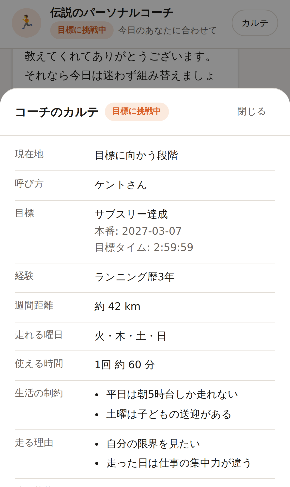

# 伝説のランニングコーチ

ランナー一人ひとりの人生に寄り添う、**伝説のパーソナルコーチAI**。

一般的なランニングアプリのように、型にはまった固定メニューを押し付けることはしません。
ユーザーの目的・心境・身体状況・スケジュールの変化を対話から学習し続け、
その瞬間に最適な一手を出し続けることだけを目的に作られています。

| 目標に向かう日常 | コーチのカルテ | 痛みがある日 |
| --- | --- | --- |
|  |  |  |

## このコーチが守っていること

### 1. ユーザーの現在地に合わせてスタイルごと変える

コーチは対話からフェーズを判断し、指導スタイルそのものを切り替えます（`src/lib/phase.ts`）。

| フェーズ | ふるまい |
| --- | --- |
| **目標に向かう段階** | 現状と目標のギャップを数字で分析し、ゴールから逆算したロードマップを提示。ただし計画よりその日のコンディションを常に優先し、迷わず組み替える。 |
| **習慣づくりの段階** | 数字とノルマを一切出さない。「好きな音楽を聴きながら15分だけ歩きませんか」までハードルを下げ、行動したこと自体を最大級に称賛する。 |
| **回復に専念する段階** | 走行メニューを一切出さない。フォームの仮説と代替トレーニング、そしてメンタルケアに全振りする。 |
| **これから知っていく段階** | 断定的なメニューを出す前に、目的・時間・体の不安を1〜2個ずつ自然に尋ねる。 |

目的が変わった瞬間（習慣づくり → 目標を持つ）は履歴に残り、コーチは**まず一緒に喜んでから**
ステップアップ計画へシームレスに移行します。アプリ側もその瞬間をお祝いバナーで拾います。

### 2. 痛みには、プロンプトではなくコードで歯止めをかける

「少しでも痛みがあれば絶対に走らせない」は、モデルの気分に委ねてよいルールではありません。
そこで `src/lib/safety.ts` に二段構えの安全層を置いています。

1. **事前**: 未解消の痛みが1つでもあれば、走行禁止の強制指示をシステムプロンプトへ機械的に差し込む。
   フェーズ判定も `recovery` に上書きされ、モデルの判断より優先される。
2. **事後**: 生成された文章を走行指示の検査にかける。痛みがある間は**検査を通るまで一文字も画面に流さず**、
   走行メニューが混ざっていたらその回答は履歴にも残さず、書き直させてから届ける。

「右膝が痛い」と打った瞬間から、まだカルテが更新される前でも慎重モードに入ります。

### 3. 生活の制約を、責めずに受け止める

「今日は忙しい」「疲れていてやる気が出ない」は、入力欄の上のワンタップで言えます。
コーチは責める代わりに即座に代替案を出し、メニューには最初から
「時間が取れない時」「疲れが強い時」の逃げ道を持たせます（`set_today_plan` の `alternatives`）。

### 4. 学習した内容は、いつでも本人が確認・削除できる

コーチが覚えていることは「カルテ」画面にすべて開示されます。ワンタップで全消去もできます。

## コーチはどうやって学習するか

Gemini の function calling を使い、会話から拾った事実をコーチ自身がカルテへ書き込みます（`src/lib/tools.ts`）。

| ツール | 呼ばれる場面 |
| --- | --- |
| `update_runner_profile` | 目標・経験・走行距離・使える曜日と時間・生活の制約・走る理由が分かった時 |
| `log_condition` | 疲労・睡眠・気分・その日使える時間を聞き出せた時 |
| `update_pain` | 痛みの訴えを聞いた時、痛みが軽くなった / 治った時 |
| `log_activity` | 走った・歩いた・補強した・休んだという報告を受けた時 |
| `set_today_plan` | その日のメニューを提示した時（代替案とセット） |
| `set_coaching_phase` | 目的や心境が変わったと判断した時 |

カルテは毎ターン、システムプロンプトの一部として組み直されます。
つまり「前回何を話したか」ではなく「この人が今どういう人か」を持って対話に臨みます。

## セットアップ

```bash
npm install
cp .env.example .env.local   # GEMINI_API_KEY を記入する
npm run dev                  # http://localhost:3000
```

API キーは [Google AI Studio](https://aistudio.google.com/apikey) で発行できます。

### 環境変数

| 変数 | 既定値 | 説明 |
| --- | --- | --- |
| `GEMINI_API_KEY` | （必須） | Gemini API キー。サーバー側でのみ使用し、ブラウザには渡しません。 |
| `GEMINI_MODEL` | `gemini-3-pro-preview` | 応答速度を優先するなら `gemini-3-flash-preview`。 |
| `GEMINI_THINKING_LEVEL` | `LOW` | `MINIMAL` / `LOW` / `MEDIUM` / `HIGH`（Gemini 3 系のみ有効）。 |
| `COACH_DATA_DIR` | `.data` | 会話とカルテの保存先。 |

### コマンド

```bash
npm run dev        # 開発サーバー
npm run build      # 本番ビルド
npm run start      # 本番サーバー
npm run typecheck  # 型検査
npm test           # テスト
```

## 構成

```
src/
├── app/
│   ├── api/chat/route.ts      対話1ターン（NDJSON ストリーミング）/ 履歴の復元
│   ├── api/profile/route.ts   カルテの取得・全消去
│   └── page.tsx               画面
├── components/                チャット UI（モバイル前提）
├── hooks/useCoachChat.ts      ストリーム受信と表示状態
└── lib/
    ├── prompt.ts              人格 + カルテ + 安全指示の三層プロンプト
    ├── phase.ts               フェーズ判定と、フェーズ別の指導スタイル
    ├── safety.ts              走行禁止の判定と、走行指示の検査
    ├── tools.ts               function calling の宣言と実行
    ├── profile.ts             カルテの更新ロジック（純関数）
    ├── gemini.ts              エージェントループ（ツール実行 + 書き直し）
    └── store.ts               保存層（JSON ファイル / メモリ）
```

### iOS・Android を見据えた設計

状態はすべてサーバー側にあり、UI は API を叩くだけのクライアントです。
ネイティブアプリからも同じ 2 つのエンドポイントをそのまま利用できます。

| エンドポイント | 用途 |
| --- | --- |
| `GET /api/chat` | これまでの会話とカルテを取得（起動時の復元） |
| `POST /api/chat` | `{"message": "..."}` を送ると NDJSON で `delta` → `done` が流れる |
| `GET /api/profile` | カルテの取得 |
| `DELETE /api/profile` | 会話とカルテの全消去 |

Web UI 側は PWA として作ってあり（`public/manifest.webmanifest`）、
ホーム画面に追加すればネイティブ化前でもアプリのように使えます。
セーフエリア、`100dvh`、16px 以上の入力欄（iOS の自動ズーム回避）に対応しています。

### 保存について

現在はユーザーごとの JSON ファイル（`COACH_DATA_DIR`）に保存します。
書き込めない環境ではメモリ保持へ自動的にフォールバックするため、対話は止まりません。
本番運用ではログイン機構とデータベースへの差し替えを想定しており、
その差し替え点は `CoachStore` インタフェース（`src/lib/store.ts`）と
`resolveUserId`（`src/lib/session.ts`）の2か所に閉じています。

## テスト

```bash
npm test
```

55 件のテストが、痛み検知・走行指示の検査・フェーズ判定・カルテ更新・
ツール実行・エージェントループ（Gemini はモック）を検証します。
とくに「痛みがある時に走らせようとしたら、書き直させてから届ける」挙動は
`tests/gemini.test.ts` で実際のループを通して確認しています。

## 注意

- 医療行為をするものではありません。強い痛み・腫れ・しびれ・長期化の兆候がある場合、
  コーチは受診を勧めるよう指示されています。
- `gemini-3-pro-preview` は preview 版のモデルです。将来の安定版が出た場合は
  `GEMINI_MODEL` で差し替えてください。
