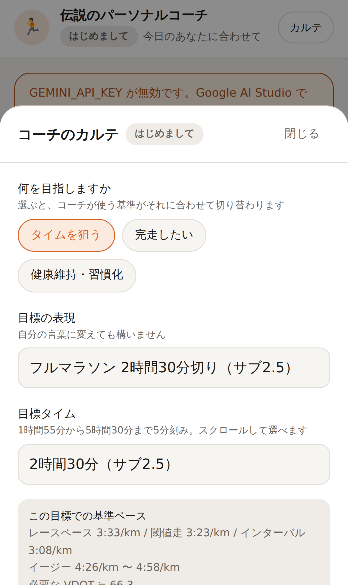
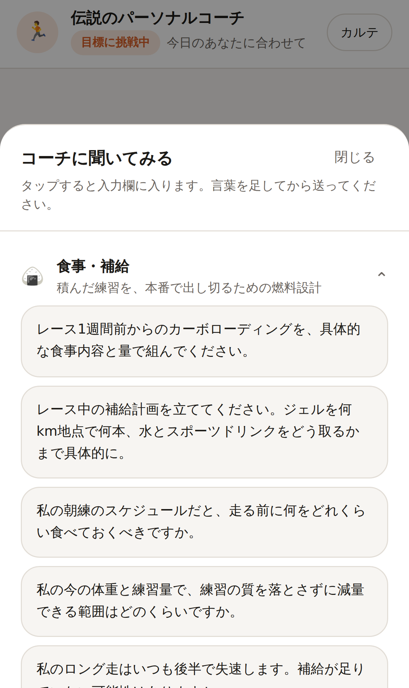

# 伝説のランニングコーチ

自分で決めた目標へ向かうランナーのための、専属パーソナルコーチAI。

サブ3でも、サブ4でも、完走でも、健康維持でも構いません。**目標が変われば基準の数字が変わるだけで、
見る観点（強度配分・心拍・フォーム・疲労）と分析の深さは変わりません。**
一般的なランニングアプリのように固定メニューを配ることはせず、当たり障りのない励ましもしません。
数字と生理学的な根拠で語り、良くない練習には良くないと言い、そのうえで必ず次の一手を示します。
Garmin のスクリーンショットを送れば、その場で読み取って評価します。

| 練習の分析 | 目標の設定 | 相談アイデア | コーチのカルテ |
| --- | --- | --- | --- |
|  |  |  |  |

## このコーチが守っていること

### 1. 目標から基準を導き、それに沿って評価する

コーチが持つ原則は、どのレベルのランナーにも共通です（`src/lib/prompt.ts`）。

- **週の8割はイージー、2割がポイント練習。** イージーが速すぎるのが最大の失敗
- 走行距離を増やすのは**前週比10%以内**。距離を積む速度が故障を決める
- 心拍ゾーンは HRmax / LTHR 基準。**基準値を持っていなければゾーン評価をせず、推測せずに尋ねる**
- ピッチ180spm前後。**膝の故障歴があるランナーでは、まずオーバーストライドを疑う**
- ロング走は距離を踏むこと自体が目的ではなく、後半に落とさず終えられたかで評価する

変わるのは**基準となる数字だけ**です。目標タイムから必要ペースを計算し、
そこから各強度のペースを導きます（`src/lib/goals.ts`）。

| 目標 | レースペース | 閾値走 | インターバル | VDOT | 週間距離の目安 |
| --- | --- | --- | --- | --- | --- |
| 2時間05分 | 2:57/km | 2:49/km | 2:37/km | 82 | 週160〜220km（2部練習前提） |
| サブ2.5 | 3:33/km | 3:23/km | 3:08/km | 66 | 週130〜180km |
| サブ3 | 4:15/km | 4:04/km | 3:46/km | 53 | 週60〜80km |
| サブ3.5 | 4:58/km | 4:45/km | 4:24/km | 45 | 週50〜70km |
| サブ4 | 5:41/km | 5:25/km | 5:01/km | 38 | 週40〜55km |
| サブ5 | 7:06/km | 6:47/km | 6:17/km | 29 | 週30〜40km |
| 完走 | ペースより「止まらずに動き続けられる時間」で評価 | | | | 週25〜35km |
| 健康維持 | 距離とタイムのノルマを置かない | | | — | — |

目標タイムは **1時間55分から5時間30分まで5分刻み**で選べます（自由入力も可能）。
世界記録水準まで含めているため、キロ2分台・3分台の練習ペースも正しく算出されます。

VDOT は Daniels の式（速度と持続時間から最大酸素摂取量を推定する）で目標タイムから計算し、
強度の物差しとしてコーチに渡しています。2時間30分を切る水準では、
市民ランナー向けの一般論をそのまま当てないよう、プロンプト側で明示的に切り替えています。

> 必要ペースは**切り捨て**で表示します。3時間切りに必要なのは 4:15.9/km ですが、
> これを四捨五入して 4:16 と伝えると、その通り走った人は 3:00:21 でゴールしてしまうためです。

目標が未設定のうちは、コーチはペース基準を出しません。まず目標と走力を尋ねます。

### 1-2. 目標も故障歴も、本人が設定・変更できる

「カルテ」画面の**編集**から、いつでも変更できます。

- 目指すもの（タイムを狙う / 完走したい / 健康維持・習慣化）
- 目標タイム（1時間55分〜5時間30分を5分刻みで選択。iPhone ではドラムロールとして開きます）
- 目標ペース（空欄なら目標タイムから自動計算。手動指定があればそちらを優先）
- 大会名・本番の日
- **故障歴・気になる部位**（1行1件。負荷を上げる判断のたびにコーチが考慮する）
- 最大心拍 / LTHR / 安静時心拍

目標を選んだ瞬間に、その目標での基準ペースが画面上で確認できます。
保存すると、次のターンからコーチの評価基準がそれに切り替わります。

### 2. 痛みには、プロンプトではなくコードで歯止めをかける

「少しでも痛みがあれば絶対に走らせない」は、モデルの気分に委ねてよいルールではありません。
そこで `src/lib/safety.ts` に二段構えの安全層を置いています。

1. **事前**: 未解消の痛みが1つでもあれば、走行禁止の強制指示をシステムプロンプトへ機械的に差し込む。
   フェーズ判定も `recovery` に上書きされ、モデルの判断より優先される。
2. **事後**: 生成された文章を走行指示の検査にかける。痛みがある間は**検査を通るまで一文字も画面に流さず**、
   走行メニューが混ざっていたらその回答は履歴にも残さず、書き直させてから届ける。

「右膝が痛い」と打った瞬間から、まだカルテが更新される前でも慎重モードに入ります。

### 3. 生活の制約を、責めずに受け止める

「今日は忙しい」「疲れていてやる気が出ない」は、入力欄の上のワンタップで言えます。
コーチは責める代わりに即座に代替案を出し、メニューには最初から
「時間が取れない時」「疲れが強い時」の逃げ道を持たせます（`set_today_plan` の `alternatives`）。

### 4. 学習した内容は、いつでも本人が確認・削除できる

コーチが覚えていることは「カルテ」画面にすべて開示されます。ワンタップで全消去もできます。

## 何を相談すればいいか分からない時

入力欄の上の「💡 何を相談する？」から、相談例を開けます。
タップすると入力欄に入るだけで、**送信はしません**。自分の言葉に直してから送れるようにするためです。

| カテゴリ | 例 |
| --- | --- |
| 🍙 食事・補給 | レース中の補給計画、カーボローディング、減量の安全な範囲 |
| 😴 睡眠・疲労 | 安静時心拍が上がっている日の判断、睡眠不足時の組み替え、心拍ドリフト |
| 🦵 コンディショニング | 張りや違和感の扱い、フォームで疑う点、レース前の不安との付き合い方 |
| 📋 練習設計 | 今週の組み立て、目標の現実性の評価、閾値走とインターバルの選択 |
| 🏁 レース戦略 | ペース配分、テーパリング、当日朝の過ごし方 |

質問文は「カルテを見ないと答えられない聞き方」に揃えてあります。
一般論で終わる質問を置くと、コーチの価値がそのまま失われるためです（`tests/suggestions.test.ts` で担保）。

## Garmin のスクリーンショットを読む

入力欄の左の画像ボタン、またはクイックボタンの「📊 Garminデータを送る」から、
Garmin Connect やランニングアプリの画面を送れます。**一度に10枚まで**なので、
心拍・ペース・ピッチ・高度・ラップといった詳細画面をまとめて渡せます。

読み取る対象:

- 走行距離 / タイム / 平均ペース
- 平均心拍 / 最高心拍（HRmax・LTHR を基準にゾーン評価）
- ピッチ / ストライド / 獲得標高、表示があれば接地時間・上下動・気温

読み取ったあと、コーチは必ずこの順で答えます。

1. **今日の練習の質** — 狙い（E / M / T / I / ロング）に対して、その強度で成立していたか
2. **疲労度** — 心拍とペースの関係、心拍ドリフト、安静時心拍との突き合わせ
3. **目標に向けた評価** — その人の目標ペースに対して今日の内容がどの位置にあるか
4. **次回の練習提案** — 距離・ペース・本数・休息と、いつやるか

**読み取れなかった項目は推測で埋めません。**「この画面からはピッチが読み取れませんでした」と明示し、
必要なら該当画面を求めます。存在しない数字で評価するのは、ランナーの判断を壊すためです。

実装上の注意点:

- 画像はブラウザ側で縮小してから送ります。**枚数に応じて圧縮率が自動で変わります**
  （1枚なら高品質のまま、10枚なら1枚あたりの容量を絞る）。
  サーバーレスのリクエスト上限に収めつつ、文字が潰れる手前で止める設計です。
  実測で10枚添付しても本文は約1.7MB に収まります
- **画像そのものは保存しません。** 保存する会話履歴からは本体を落とし、「添付があった」跡だけを残します
  （`stripInlineData`）。読み取った数値はカルテ側に構造化して残ります
- 画像認識に対応したモデルが必要です。既定の Gemini 3 系はいずれも対応しています

## コーチはどうやって学習するか

Gemini の function calling を使い、会話から拾った事実をコーチ自身がカルテへ書き込みます（`src/lib/tools.ts`）。

| ツール | 呼ばれる場面 |
| --- | --- |
| `update_runner_profile` | 目標・経験・走行距離・**最大心拍/安静時心拍/LTHR**・使える曜日と時間・生活の制約・故障歴が分かった時 |
| `log_condition` | 疲労・睡眠・気分・その日使える時間を聞き出せた時 |
| `update_pain` | 痛みの訴えを聞いた時、痛みが軽くなった / 治った時 |
| `log_activity` | 練習の報告を受けた時、および**スクリーンショットから数値を読み取った時**（種別・ペース・心拍・ピッチ・ストライド・獲得標高を構造化して保存） |
| `set_today_plan` | その日のメニューを提示した時（代替案とセット） |
| `set_coaching_phase` | 目的や心境が変わったと判断した時 |

カルテは毎ターン、システムプロンプトの一部として組み直されます。
つまり「前回何を話したか」ではなく「この人が今どういう人か」を持って対話に臨みます。

## セットアップ

必要なもの: Node.js 20.9 以上と、Gemini API キー。

```bash
npm install
cp .env.example .env.local   # GEMINI_API_KEY を記入する
npm run dev                  # http://localhost:3000
```

API キーは [Google AI Studio](https://aistudio.google.com/apikey) で発行できます。

### 環境変数

| 変数 | 既定値 | 説明 |
| --- | --- | --- |
| `GEMINI_API_KEY` | （必須） | Gemini API キー。サーバー側でのみ使用し、ブラウザには渡しません。 |
| `GEMINI_MODEL` | `gemini-3-pro-preview` | 応答速度を優先するなら `gemini-3-flash-preview`。 |
| `GEMINI_THINKING_LEVEL` | `LOW` | `MINIMAL` / `LOW` / `MEDIUM` / `HIGH`（Gemini 3 系のみ有効）。 |
| `COACH_DATA_DIR` | `.data` | 会話とカルテの保存先。 |

### コマンド

```bash
npm run dev        # 開発サーバー
npm run build      # 本番ビルド
npm run start      # 本番サーバー
npm run typecheck  # 型検査
npm test           # テスト
```

## 構成

```
src/
├── app/
│   ├── api/chat/route.ts      対話1ターン（NDJSON ストリーミング）/ 履歴の復元
│   ├── api/profile/route.ts   カルテの取得・全消去
│   └── page.tsx               画面
├── components/                チャット UI（モバイル前提）
├── hooks/useCoachChat.ts      ストリーム受信と表示状態
└── lib/
    ├── prompt.ts              人格 + カルテ + 安全指示の三層プロンプト
    ├── phase.ts               フェーズ判定と、フェーズ別の指導スタイル
    ├── safety.ts              走行禁止の判定と、走行指示の検査
    ├── tools.ts               function calling の宣言と実行
    ├── images.ts              添付画像の検証（形式・枚数・サイズ）
    ├── downscale.ts           ブラウザ側での画像縮小
    ├── markers.ts             履歴に埋める内部マーカー（内部指示・添付の跡）
    ├── goals.ts               目標から基準ペース・VDOT・練習量を導く
    ├── suggestions.ts         相談アイデア（質問例）
    ├── profile.ts             カルテの更新ロジック（純関数）
    ├── gemini.ts              エージェントループ（ツール実行 + 書き直し）
    └── store.ts               保存層（JSON ファイル / メモリ）
```

### iOS・Android を見据えた設計

状態はすべてサーバー側にあり、UI は API を叩くだけのクライアントです。
ネイティブアプリからも同じ 2 つのエンドポイントをそのまま利用できます。

| エンドポイント | 用途 |
| --- | --- |
| `GET /api/chat` | これまでの会話とカルテを取得（起動時の復元） |
| `POST /api/chat` | `{"message": "..."}` を送ると NDJSON で `delta` → `done` が流れる |
| `GET /api/profile` | カルテの取得 |
| `PATCH /api/profile` | 目標・目標ペース・故障歴・心拍の設定変更 |
| `DELETE /api/profile` | 会話とカルテの全消去 |

Web UI 側は PWA として作ってあり（`public/manifest.webmanifest`）、
ホーム画面に追加すればネイティブ化前でもアプリのように使えます。
セーフエリア、`100dvh`、16px 以上の入力欄（iOS の自動ズーム回避）に対応しています。

### Vercel にデプロイする場合

1. Vercel のプロジェクト設定 → **Settings → Environment Variables** に `GEMINI_API_KEY` を追加する
   （対象は Production と Preview の両方）。
2. 環境変数を足した後は**再デプロイが必要**です。既存のデプロイには反映されません。
3. モデルを変えたい場合は `GEMINI_MODEL` も同じ場所に足します。

既定のモデル `gemini-3-pro-preview` がそのキーで使えない場合（404、あるいは無料枠で割り当てが 0 のため 429）、
自動的に `gemini-3-flash-preview` へ退避して対話を続けます。切り替わったことはサーバーログに残ります。

**会話とカルテは保存され続けません。** サーバーレス環境ではアプリのディレクトリが読み取り専用なので、
保存先は `/tmp` になります。これはインスタンスごとに独立し、しばらく使われないと消えます。
つまり Vercel 上では、コーチが数時間前の会話を覚えていないことがあります。
本番として使うなら、`CoachStore`（`src/lib/store.ts`）をデータベース実装に差し替えてください。

### 今どのビルドを見ているかを確かめる

Vercel の**プレビューURLはデプロイごとに固定**で、あとから push しても
そのURLの中身は変わりません（新しいデプロイは別のURLになります）。
「直したはずなのに同じエラーが出る」時は、たいてい古いデプロイを開いています。

確認用のエンドポイントを用意しています。ブラウザでそのまま開けます。

```
https://<あなたのデプロイURL>/api/health
```

```json
{
  "ok": true,
  "commit": "49f0224",
  "model": "gemini-3-pro-preview",
  "hasApiKey": true,
  "apiKeyLooksValid": true,
  "environment": "production"
}
```

`commit` が最新のコミットと一致していなければ、古いデプロイを見ています。
`apiKeyLooksValid` が `false` なら、環境変数に引用符や改行が混ざっています
（`"AIza..."` のように引用符ごと貼り付けた時によく起きます）。
**API キーの値そのものは返しません。**

同じ内容はアプリの「カルテ」画面の一番下にも表示されます。

### うまく動かない時

コーチが「接続がうまくいきませんでした」と返す場合、エラーの下の
**「エラーの詳細を表示」**を開くと、Gemini API が返した生のメッセージが読めます。
よくある原因は次のとおりです。

| 詳細に出る内容 | 原因と対処 |
| --- | --- |
| `API key not valid` | キーが誤っているか失効。作り直して環境変数を更新し、再デプロイ。 |
| `PERMISSION_DENIED` | キーに HTTP リファラ / IP 制限がかかっている、または Generative Language API が無効。 |
| `NOT_FOUND` / `is not found` | そのモデルがキーで使えない。`GEMINI_MODEL` を `gemini-3-flash-preview` に。 |
| `RESOURCE_EXHAUSTED` | 利用上限。時間をおくか、有料プランを検討。 |

サーバー側のログ（Vercel なら Runtime Logs）にも `[coach] turn failed` として同じ内容が出ます。

### 保存について

ローカルではユーザーごとの JSON ファイル（既定 `.data/`、`COACH_DATA_DIR` で変更可）に保存します。
サーバーレス環境では自動的に `/tmp` を使い、そこも書けなければメモリ保持へ退避するため、対話自体は止まりません。
本番運用ではログイン機構とデータベースへの差し替えを想定しており、
その差し替え点は `CoachStore` インタフェース（`src/lib/store.ts`）と
`resolveUserId`（`src/lib/session.ts`）の2か所に閉じています。

## テスト

```bash
npm test
```

141 件のテストが、痛み検知・走行指示の検査・目標からのペースとVDOTの導出・フェーズ判定・
カルテ更新・ツール実行・画像の検証と保存時の除去・エージェントループ（Gemini はモック）を検証します。
とくに次の2つは、実際のループを通して確認しています。

- 痛みがある時に走らせようとしたら、書き直させてから届ける（`tests/gemini.test.ts`）
- 画像の base64 が保存先に残らない（`tests/images.test.ts`）
- 目標を変えると評価基準が切り替わる（`tests/goals.test.ts`, `tests/prompt.test.ts`）
- 世界記録水準でもキロ2分台の練習ペースが正しく出る（`tests/goals.test.ts`）

## 注意

- 医療行為をするものではありません。強い痛み・腫れ・しびれ・長期化の兆候がある場合、
  コーチは受診を勧めるよう指示されています。
- `gemini-3-pro-preview` は preview 版のモデルです。将来の安定版が出た場合は
  `GEMINI_MODEL` で差し替えてください。
